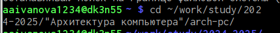
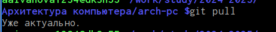
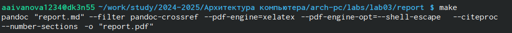
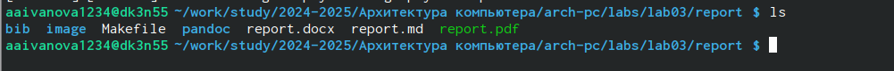
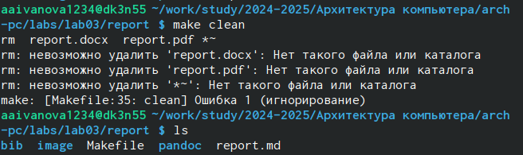
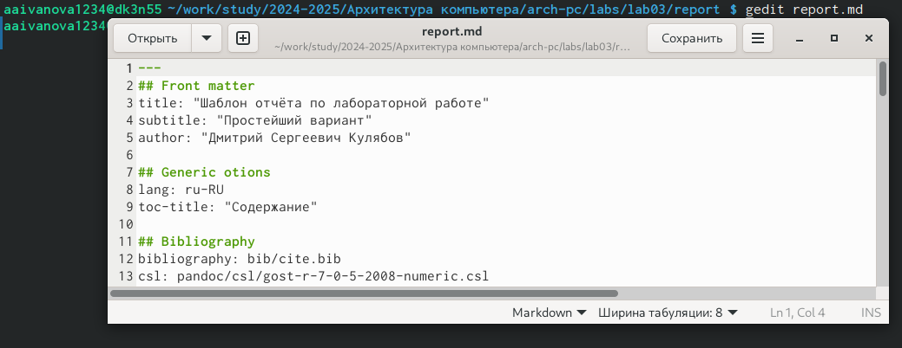
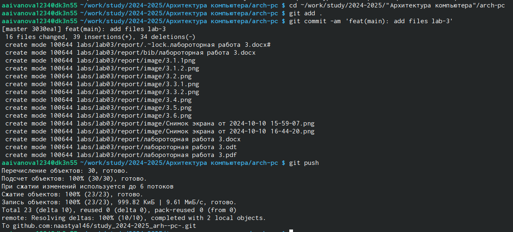

---
## Front matter
title: "Лабороторная работа №3"
subtitle: "Простейший вариант"
author: "Анастасия Александровна Иванова"

## Generic otions
lang: ru-RU
toc-title: "Содержание"

## Bibliography
bibliography: bib/cite.bib
csl: pandoc/csl/gost-r-7-0-5-2008-numeric.csl

## Pdf output format
toc: true # Table of contents
toc-depth: 2
lof: true # List of figures
lot: true # List of tables
fontsize: 12pt
linestretch: 1.5
papersize: a4
documentclass: scrreprt
## I18n polyglossia
polyglossia-lang:
  name: russian
  options:
	- spelling=modern
	- babelshorthands=true
polyglossia-otherlangs:
  name: english
## I18n babel
babel-lang: russian
babel-otherlangs: english
## Fonts
mainfont: IBM Plex Serif
romanfont: IBM Plex Serif
sansfont: IBM Plex Sans
monofont: IBM Plex Mono
mathfont: STIX Two Math
mainfontoptions: Ligatures=Common,Ligatures=TeX,Scale=0.94
romanfontoptions: Ligatures=Common,Ligatures=TeX,Scale=0.94
sansfontoptions: Ligatures=Common,Ligatures=TeX,Scale=MatchLowercase,Scale=0.94
monofontoptions: Scale=MatchLowercase,Scale=0.94,FakeStretch=0.9
mathfontoptions:
## Biblatex
biblatex: true
biblio-style: "gost-numeric"
biblatexoptions:
  - parentracker=true
  - backend=biber
  - hyperref=auto
  - language=auto
  - autolang=other*
  - citestyle=gost-numeric
## Pandoc-crossref LaTeX customization
figureTitle: "Рис."
tableTitle: "Таблица"
listingTitle: "Листинг"
lofTitle: "Список иллюстраций"
lotTitle: "Список таблиц"
lolTitle: "Листинги"
## Misc options
indent: true
header-includes:
  - \usepackage{indentfirst}
  - \usepackage{float} # keep figures where there are in the text
  - \floatplacement{figure}{H} # keep figures where there are in the text
---

# Цель работы

Научится процедуре оформления отчетов с помощью языка разметки
Markdown,так же научится создавать структурированные и читабельные
документы.

# Задание

1. Обновить локальный репозиторий с помощью git pull.
2. Скомпилировать шаблон отчета с помощью make
3. Проверить корректность полученных файлов report.pdf и report.docx.
4. Удалить сгенерированные файлы с помощью make clean.
5. Открыть файл report.md в текстовом редакторе и заполнить отчет.
6. Скомпилировать отчет с помощью make.
7. Проверить корректность полученных файлов report.pdf и report.docx.
8. Загрузить файлы report.md, report.pdf и report.docx на GitHub

# Выполнение лабораторной работы

1. Откроем терминал и перейдем в каталог курса сформированный при выполнении лабораторной работы№2
{#fig:001 width=70%}
 
 Обновим локальный репозиторий, скачав изменения из удаленного репозитория с помощью команды
  {#fig:001 width=70%}

2. Перейдем в каталог с шаблоном отчета по лабораторной работе № 3
 {#fig:001 width=70%}

3. Проведем компиляцию шаблона с использованием Makefile. Для этого введите ко-
манду
{#fig:001 width=70%}

 Откроем и проверим корректность полученных файлов
 {#fig:001 width=70%}

4. Удалим полученный файлы с использованием Makefile. Для этого введем команду
make clean и проверим, что после этой команды файлы report.pdf и report.docx были удалены
{#fig:001 width=70%}

5. Откроем файл report.md c помощью любого текстового редактора, например gedit
{#fig:001 width=70%}

6. Загрузим файлы на  Github
{#fig:001 width=70%}

# Выводы

В ходе работы мы успешно освоили основы языка разметки Markdown, научившись создавать структурированные тексты с заголовками, списками, таблицами, изображениями и ссылками. Благодаря этому, мы теперь можем эффективно создавать различные текстовые документы, такие как отчеты, презентации, используя удобный и универсальный Markdown. Приобретенные навыки окажутся ценными как в учебной деятельности, так и в будущей профессиональной карьере.

